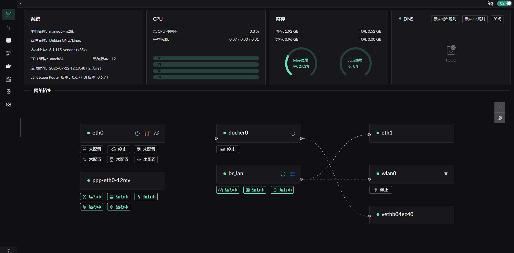

# Landscape - Linux Router Configuration Tool  

Landscape is a Web UI-based tool that allows you to easily configure your favorite Linux distribution as a router.  

> Developed using Rust / eBPF / AF_PACKET.  

[中文文档](./README.zh.md) | [English](./README.md)  

## Screenshots  
  

---  
## Features  
> ✅ Implemented and tested  
> ⚠ Feasible but untested  
> ❌ Not implemented  

- <u>IP Configuration</u>  
    - *Static IP Configuration*  
        - ✅ Specify IP  
        - ✅ Configure gateway and set default route  
    - *DHCP Client*  
        - ✅ Specify hostname  
        - ❌ Custom Options  
    - *PPPoE (PPPD Version)*  
        - ✅ Default route assignment  
        - ⚠ Multi-NIC dial-up  
        - ✅ Specify network interface  
    - *PPPoE (eBPF Version)*  
        - ✅ Protocol core implementation  
        - ❌ Packet size exceeding MTU due to NIC GRO/GSO (Unresolved)  
    - *DHCP Server*  
        - ✅ Provides simple IP allocation and renewal services  
        - ✅ Customizable gateway, subnet, and access rules for assigned IPs  
- <u>Traffic Tagging Module</u>  
    - ✅ Forward tagged traffic based on tag settings (Direct/Drop/Block Hole Punching/Redirect to Docker container or network interface)  
    - ❌ Traffic statistics  
    - ❌ Connection tracking tagging  
    - ✅ Internal network IP behavior control based on tagging rules  
    - ✅ External network IP behavior control based on tagging rules, with support for `geoip.dat`  
    - ❌ Automatic GeoIP file updates  
- <u>DNS</u>  
    - ✅ Assign specific upstream DNS for designated domains  
    - ✅ DNS hijacking (Returning A records)  
    - ❌ DNS hijacking returning multiple records (other than A records)  
    - ✅ Tagging DNS resolution results and processing them using the tagging module  
    - ✅ GeoSite file support  
    - ❌ Automatic scheduled GeoSite file updates  
    - ❌ Cache Docker container image names in DNS resolution  
- <u>NAT (eBPF-based) Implementation</u>  
    - ✅ Basic NAT  
    - ⚠ Static mapping / Port forwarding (UI incomplete)  
    - ✅ Hole punching prevention - restricts access to open ports based on tagged IP rules  
- <u>Docker</u>  
    - ✅ Basic Docker container management  
    - ⚠ Image pulling  
    - ✅ Redirect traffic into a Docker container running TProxy  
- <u>WIFI</u>  
    - ❌ Create a WIFI hotspot  
    - ❌ Connect to a WIFI hotspot  
- <u>Miscellaneous</u>  
    - ✅ Login page  
    - ❌ English version of the frontend  
    - ❌ Standardized logging  
    - ❌ Network interface XPS/RPS optimization to distribute NIC load across different CPU cores for better throughput  

---  

## Startup and Limitations  

### System Requirements  
- Supported Linux Kernel Version: `6.1` and above.  
- Requires `iptables (for PPPoE MSS clamping)`, `docker`.  

### Standard Startup Steps  
1. Create the configuration directory:  
   ```shell
   mkdir -p ~/.landscape-router
   ```
2. Create an initial configuration file `landscape_init.toml`, refer to [Quick Start Configuration](https://landscape.whileaway.dev/quick.html).  

3. Start the service:  
   Download the required version from [Releases](https://github.com/ThisSeanZhang/landscape/releases) and run the following command to start the service (default port: `6300`):  
   ```shell
   ./landscape-webserver
   ```

### Docker Compose Quick Start  
Refer to [Quick Start](https://landscape.whileaway.dev/quick.html).  

### Armbian Integration  
Refer to [Armbian Integration](https://landscape.whileaway.dev/compilation/armbian.html).  

---  

## Compilation  
Refer to [Compilation](https://landscape.whileaway.dev/compilation/).  

## LICENSE  

- `landscape-ebpf`: [GNU General Public License v2.0](https://www.gnu.org/licenses/old-licenses/gpl-2.0.html)  
- Other parts: [GNU General Public License v3.0](https://www.gnu.org/licenses/gpl-3.0.html)  

---  

If you have any suggestions or issues, feel free to submit feedback on the [issues](./issues/new) page.  
