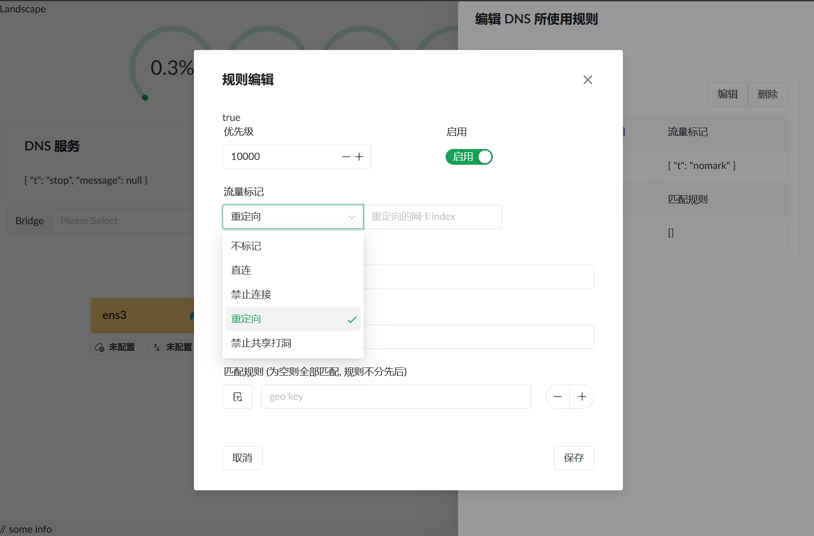
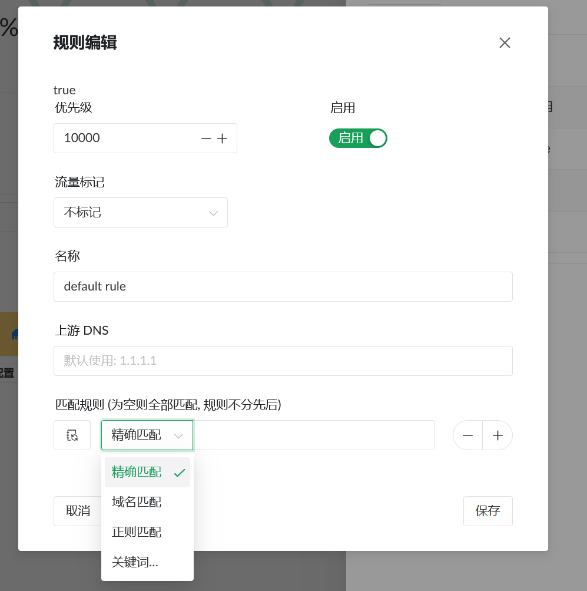

# Landscape Router
使用 eBPF 技术,以及 AF_PACKET. 通过网页操作将 Linux 配置成 路由.

目前的功能都是使用 Rust 进行实现的

## 截图





## 启动方式以及限制
目前功能所需的 Linux 版本需要在 `6.1` 及以上

启动前需要先在 用户的 `home` 目录创建 
```shell
mkdir -p ~/.landscape-route
```

然后将 `geosite.dat` 文件, 放入该文件夹.

### 编译
请在确保安装完成 `node` `yarn` `rust` 的情况下继续
```shell
# 安装所需库和工具
apt install pkg-config bpftool build-essential clang libelf1 libelf-dev zlib1g-dev

# 编译
build.sh
```

产物将会在 `output` 文件夹中

运行即可, 服务的端口是 `6300`
```shell
./landscape-webserver
```

## 目前实现的主要功能
* IP 配置
    * PPPoE: 使用 eBPF 技术直接在 Linux 数据包 `出 / 入栈` 时直接修改数据包 PPPoE 头部.
    * DHCP Client: (目前是简单配置, DHCP Option 是可以继续编写代码进行增加的， 目前没暴露到网页端配置)
    * DHCP Server: (目前是简单配置, 默认的网段是 `192.168.5.1/24` 前端页面的配置设置没有开放， 也是目前没暴露到网页端配置)
* DNS 配置
    * 支持指定的网址使用特定的 `上游 DNS` 进行解析, 还有进行 DNS 解析的流量进行标记,
        这样可以避免 `DNS 地理位置负载均衡` 导致与错误的服务器连接
    * 支持通过 `geosite` 数据进行流量标记. 和 mark 部分结合可以进行丢弃, 转发到指定网卡, 等操作.
* NAT 功能
    * 在 eBPF 中实现了 NAT, 后续的设想是配合 DNS 中的 mark 标记, 可以将部分 IP/网站 发起的连接变成 `Symmetric NAT`, 这样其他的 IP 就不能复用开启的 NAT 端口, 达到限制某些网站打洞的目的.
* 标记模块
    * 将被 DNS 中标记的 IP 按照指定的配置进行操作， 或者标记一些流量在 NAT 中的行为限制

## 目前遇到的困境
* 在 eBPF 中观察到的数据包， 可以常看到超过 MTU 大小的数据包。即使发送 `ICMP "Fragmentation needed"` 消息后还是能接收到，我关闭了 `gro` `tso` `gso` 还是会出现, 也可能是我配置的问题。
* 代码结构较为混乱，不知道该怎么进行梳理...


## 待实现的功能
- [ ] 管理员登录页面
- [ ] geosite 文件定期更新
- [ ] 日志记录， 包括运行日志 
- [ ] 流量分析， 指定 IP 抓包等
- [ ] Docker 支持， 比如将流量转发到 Docker 容器的网卡上， 由容器中的程序决定要怎么操作， 可以查看 ebpf bin 中 ns_proxy_test 中相关示例
- [ ] 等...

# LICENSE
> 我不确定这样是否正确， 如果不正确请指正我
>
> I'm not sure if this is correct, please correct me if it is not
* landscape/landscape-ebpf: GNU General Public License v2.0
* other: General Public License v3.0
