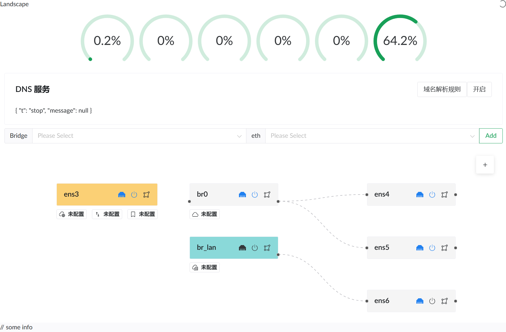

# Landscape - Linux 路由器配置工具

Landscape 是一个基于 Web UI 的工具，可以轻松将您喜爱的 Linux 发行版配置为路由器。

> 基于 Rust / eBPF / AF_PACKET 开发。

## 截图


---

## 启动方式和限制

### 系统要求
- 支持的 Linux 内核版本：`6.1` 及以上。

### 启动步骤
1. 创建配置文件夹：
   ```shell
   mkdir -p ~/.landscape-router
   ```
2. 将 `geosite.dat` 文件放入上述文件夹。

3. 启动服务：
   编译完成后，运行以下命令启动服务（默认端口：`6300`）：
   ```shell
   ./landscape-webserver
   ```

---

## 编译

### 依赖安装
请确保安装以下依赖：
```shell
apt install pkg-config bpftool build-essential clang libelf1 libelf-dev zlib1g-dev
```

### 编译步骤
确保系统已安装 `node`、`yarn` 和 `rust`，然后运行以下命令进行编译：
```shell
./build.sh
```

编译完成后，产物将存放在 `output` 文件夹中。

---

## 功能

| 功能模块       | 状态 | 说明 |
|----------------|-------|------|
| **IP 配置**    |       |      |
| PPPoE          | ✅    | 使用 pppd 客户端支持多个连接 |
| PPPoE          | ❌    | eBPF 数据包处理暂未解决 GSO/GRO 问题 |
| DHCP 客户端    | ✅    | 可进行 IP 请求并配置 IP |
| DHCP 客户端    | ❌    | 支持指定 DHCP Option |
| DHCP 服务端    | ✅    | 提供简单 IP 地址分配和续期服务（默认网段为 `192.168.5.1/24`） |
| DHCP 服务端    | ❌    | 自定义配置 |
| **标记模块**   |       |      |
| 流量转发       | ✅    | 将 DNS 标记的流量转发到指定 Docker 容器 |
| 流量统计       | ❌    | 对特定流量进行统计和记录 |
| **DNS 配置**   |       |      |
| 上游 DNS       | ✅    | 支持指定网址使用特定上游 DNS |
| GeoSite 支持   | ✅    | 使用 `geosite.dat` 标记相关流量避免错误连接 |
| GeoSite 更新   | ❌    | 定时更新 `geosite.dat` 文件，不存在时自动下载 |
| **NAT 功能**   |       |      |
| 基础 NAT       | ✅    | 基于 eBPF 实现基础 NAT 功能 |
| Symmetric NAT | ❌    | 配合 DNS 和标记模块，限制某些网站打洞 |
| **Docker 支持**|       |      |
| 容器管理       | ✅    | 支持简单运行和管理 Docker 容器 |
| 流量导入       | ✅    | 将流量导入运行 tproxy 的 Docker 容器 |
| **杂项**       |       |      |
| 登录界面       | ❌    | 添加登录逻辑和界面 |
| 日志记录       | ❌    | 规范化日志记录 |
| 英文界面       | ❌    | 添加英文版前端页面 |

---

## 当前问题 😥

1. **PPPoE MTU 问题**
   - 数据包超出 MTU 大小，可能由 `GRO` 或 `GSO` 引起。关闭该功能会增加网卡消耗，目前使用 `pppd` 规避。
   - 相关代码参考：[PPPoE egress 实现](https://github.com/ThisSeanZhang/landscape/blob/424b842c29c469e4ad14503ee2bf9190ee24fd11/landscape/landscape-ebpf/src/bpf/pppoe.bpf.c#L68-L74)

2. **容器 DNS 问题**
   - 容器内指定宿主机为 DNS 服务器时，`dig` 命令正常，但 `curl` 无法访问（提示找不到主机）。宿主机无此问题。

3. **代码结构问题**
   - 代码结构较为混乱，模块化逻辑尚未理清。

---

## LICENSE

- `landscape/landscape-ebpf`: [GNU General Public License v2.0](https://www.gnu.org/licenses/old-licenses/gpl-2.0.html)
- 其他部分: [GNU General Public License v3.0](https://www.gnu.org/licenses/gpl-3.0.html)

---

如果您有任何建议或问题，可以在 [issues](./issues/new) 页面提交您的反馈。
