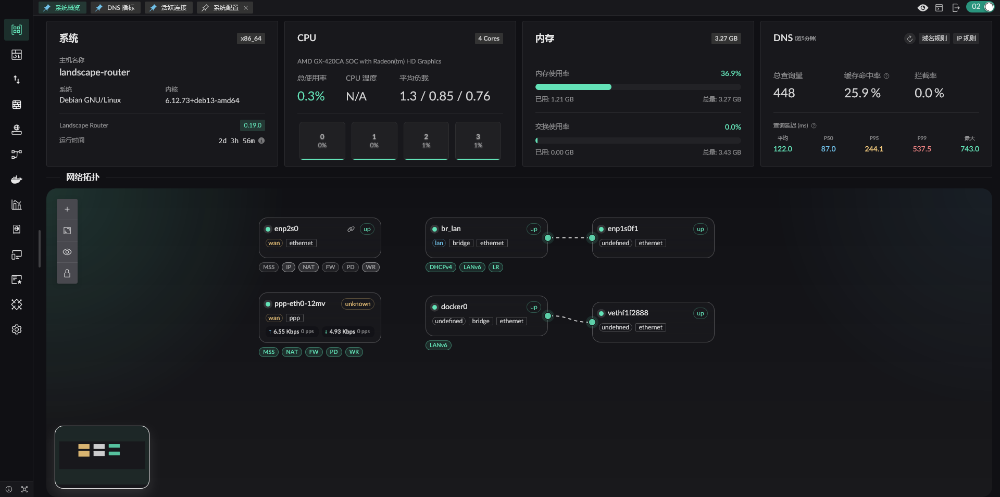

# Landscape - 以 eBPF 为基础的 Linux 路由平台

[](https://www.gnu.org/licenses/gpl-3.0)
[![DeepWiki](https://img.shields.io/badge/DeepWiki-ThisSeanZhang%2Flandscape-blue.svg?logo=)](https://deepwiki.com/ThisSeanZhang/landscape)

<!-- DeepWiki badge generated by https://deepwiki.ryoppippi.com/ -->

Landscape 的目标是让你更轻松的将自己喜欢的 Linux 发行版配置成路由器

Landscape 是一个以 eBPF 为基础的 Linux 路由平台，提供网络服务管理、策略控制 和 API

> 基于 Rust / eBPF / AF_PACKET 开发。

[简体中文](./README.zh.md) | [English](./README.md)

> 详细文档: <https://landscape.whileaway.dev/>

## 截图


---

## 核心特性
* eBPF 分流，直连流量性能不受影响，使用 (SIP-CIDR、MAC), 分流对象: (DIP、域名、Geo 匹配规则)
* 每个流 Flow 独立 dns 配置以及缓存（避免 dns 污染、泄露）
* 流量导入 Docker 容器，可在容器中运行支持 TProxy 的程序进行扩展
* 地理关系库管理， 支持 DAT/TXT 格式
* 默认 更严格的 NAT4, 但可让指定 IP/域名 使用 NAT1, 方便进行组网等操作, 详情见文档: [NAT4? 不, 比 NAT4 更严格](https://landscape.whileaway.dev/feature/nat/nat.html) 
* 提供 API, 可通过 API 操作所有在 UI 上可操作的内容

---

## 为什么编写 Landscape
最直接的原因，是希望继续使用自己熟悉的 Linux 发行版来做路由，而不是被限定在某一种系统上。除了 Debian 之外，Landscape 已经有 Arch、openSUSE 等发行版的实际使用反馈。

是可以通过组合 Linux 上现成的各种程序来搭建一套路由方案，而且确实能稳定运行；但这类方案通常配置分散、维护成本高，还要额外处理配置文件的存储与迁移。Landscape 将这些配置集中到一个目录中管理，新版本可直接替换运行，启动后会自动迁移配置；需要回退时，也支持降级。

此外，内网里常常会有 BT/PT 之类需要 NAT1 的程序，但并不希望其他 PCDN 程序偷跑流量。为此，Landscape 提供了更细粒度的 NAT 控制，可以按域名或 IP 决定不同流量采用怎样的 NAT 行为。

内网中的不同设备往往需要不同的分流策略，同时也希望在容器发生故障时，直连流量仍然能够继续工作，不会被一并拖垮。

## 快速开始

### 注意事项

- Linux 内核 `6.9` 或更高版本, 该项目高度依赖 Linux 内核提供的能力, 所以 FreeBSD / macOS 之类的类 Unix 内核无法使用
- 内核需启用 BTF/BPF 功能
- 需要 `root` 权限启动服务
- 如果要使用容器导流或容器管理能力，需要额外安装 Docker
- 发布包中的后端二进制和前端静态文件是分开提供的, 需要分别单独下载
- 默认情况下，如果没有额外配置静态 NAT 或暴露路径，管理界面无法从 WAN 侧直接访问

### 1. 创建配置目录

```bash
mkdir -p /root/.landscape-router
```

### 2. 下载发布资源

- 从 [Releases](https://github.com/ThisSeanZhang/landscape/releases)
  - 下载 `static.zip`
  - 下载对应架构的 `landscape-webserver` 二进制文件
- 解压到 `/root/.landscape-router/static` (可额外指定, 此为默认路径)

### 3. 启动 Landscape

使用 `root` 运行：

```bash
./landscape-webserver
```

默认运行参数：

- 配置目录：`/root/.landscape-router`
- HTTP 跳转端口：`6300`
- HTTPS 端口：`6443`
- 默认用户名：`root`
- 默认密码：`root`

Landscape 可以在没有预置配置文件的情况下直接启动。如果你想通过 `landscape_init.toml` 进行初始化，请查看文档站中的配置说明。

更多参数可通过 `./landscape-webserver --help` 查看。

### 4. 打开管理界面

- `http://landscape.local:6300` 会自动跳转到 HTTPS
- `https://landscape.local:6443` 打开 Web UI
- `https://landscape.local:6443/api/docs` 打开 REST API 文档

## 开机启动

确认服务运行正常后，可以把它配置成 `systemd` 服务：

```ini
[Unit]
Description=Landscape Router

[Service]
ExecStart=/root/landscape-webserver
Restart=always
User=root
LimitMEMLOCK=infinity

[Install]
WantedBy=multi-user.target
```

请把 `ExecStart` 改成你实际的二进制路径。

## License

- `landscape-ebpf`: [GNU General Public License v2.0](https://www.gnu.org/licenses/old-licenses/gpl-2.0.html)
- 其他部分: [GNU General Public License v3.0](https://www.gnu.org/licenses/gpl-3.0.html)

如果你有建议或遇到问题，请在这里提交 issue: <https://github.com/ThisSeanZhang/landscape/issues>

## Star History

<a href="https://www.star-history.com/#ThisSeanZhang/landscape&Date">
 <picture>
   <source media="(prefers-color-scheme: dark)" srcset="https://api.star-history.com/svg?repos=ThisSeanZhang/landscape&type=Date&theme=dark" />
   <source media="(prefers-color-scheme: light)" srcset="https://api.star-history.com/svg?repos=ThisSeanZhang/landscape&type=Date" />
   
 </picture>
</a>
