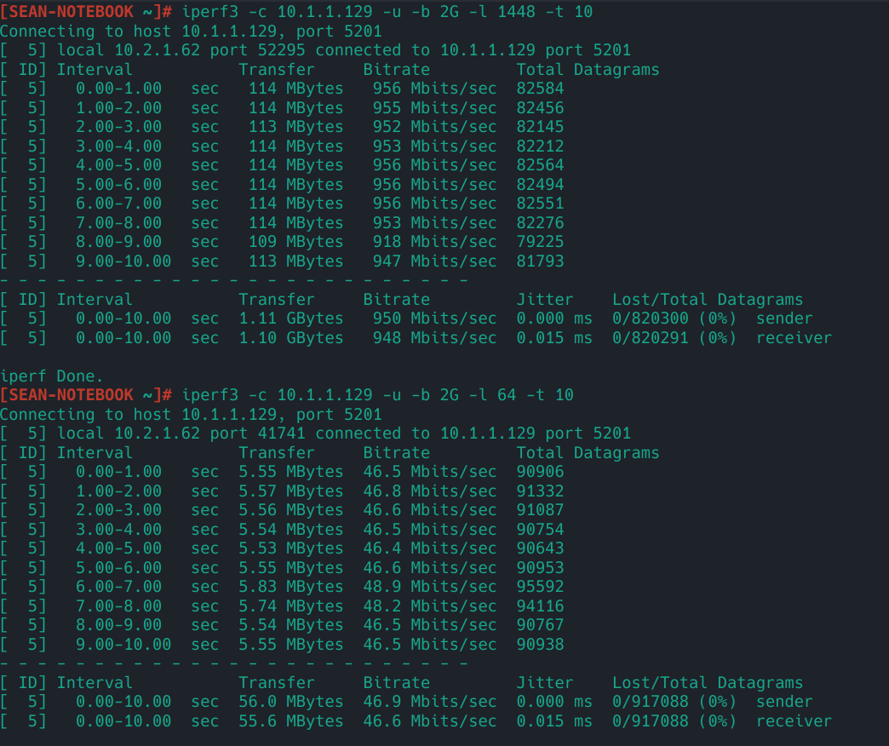

# eBPF 路由
当前 Lan / Wan 要能通信， 需要将对应 Wan 和 Lan 网卡的路由转发功能开启。

## 加速原理

> you can find on [Wikipedia](https://en.wikipedia.org/wiki/Netfilter#/media/File:Netfilter-packet-flow.svg) under CC BY-SA 3.0 license

上图展示了 Netfilter 的工作流程。Netfilter 是 Linux 内核中的数据包处理框架，负责提供钩子（hooks）机制和数据包的过滤、修改等操作。iptables 和 nftables 则是基于 Netfilter 的用户空间工具，用于配置和管理防火墙规则。

当前程序的转发工作在上图的 **Ingress / Egress (qdisc)** 也就是在进入 Netfilter 之前， 就能决定发往哪个网口， 并且直接发送到网卡。以此进行加速转发。 不过目前没有将 NAT 中的连接共享到当前的实现中。 所以当前的加速效果并不是很明显。

目前只是从 0 —> 1 的实现。 之后将会做更多的优化。

而且判断是否转发到 Docker 容器， 也是在此进行的。所以对直连流量几乎是无损耗的。

## 在 M28K 的情况下, 进行的测试
* CPU: ARM RK3528A
* 系统是部署在 emmc 上

## CPU 占用对比
相同硬件, 同样使用运营商提供的测速网站进行测速, CPU 占用最高只到 25%. (B 站第一次视频中达到 50%).
> 测试时正在直播, 同时进行的有直播流量的上传

## IPerf3 测试
> 我对这个软件使用的较少, 如果测试的方式不对的话, 还请指出.

以下图片是开启 **WAN 网卡** 上的 **NAT** 以及 **WAN 路由转发** , **LAN 网卡** 的 **LAN 路由转发** 的条件下进行测试的.

之后还换了其他的网卡, 有些能到 17w (同 NAT + 转发), 由于手头上没有其他更好的硬件， 所以测试仅供参考， 而且当前没有进行优化， 是初始版本。 当前 M28K 跑满千兆是没什么问题的。
