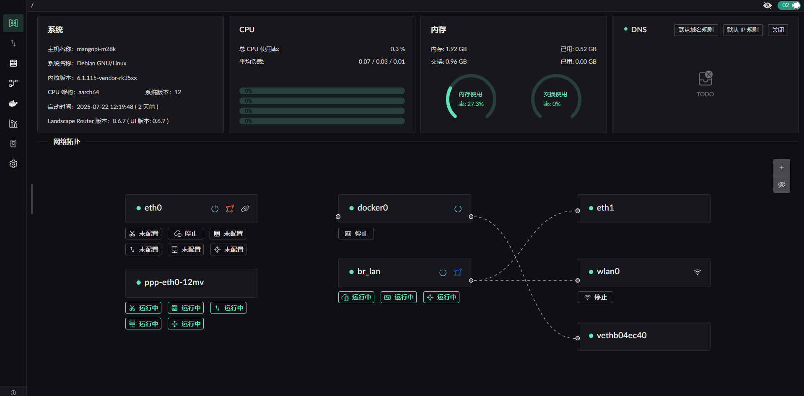

# Landscape Router
Landscape Router 是一个使用了 eBPF / Rust / Vue 开发的可以帮助你将 Linux 配置成 **路由** 的工具

## 整体界面

## 主要功能

| 功能模块       | 状态 | 说明 |
|----------------|-------|------|
| **IP 配置**    |       |      |
| PPPoE (pppd)  | ✅    | 使用 pppd 客户端支持多个连接 |
| PPPoE (eBPF)  | ❌    | eBPF 数据包处理暂未解决 GSO/GRO 问题 |
| 静态 IP 配置   | ✅    | 静态 IP 配置 |
| DHCP Client    | ✅    | 可进行 IP 请求并配置 IP |
| DHCP Client    | ❌    | 支持指定 DHCP Option |
| DHCP Server    | ✅    | 提供简单 IP 地址分配和续期服务（默认网段为 `192.168.5.1/24`） |
| DHCP Server    | ✅    | 自定义分配 IP 配置 |
| **标记模块**   |       |      |
| 流量转发       | ✅    | 将 DNS 标记的流量转发到指定 Docker 容器 |
| 流量统计       | ❌    | 对特定流量进行统计和记录 |
| **IP 行为控制**   |       |      |
| 内网 IP 行为控制 | ✅    | 控制内网 IP 的数据包行为 |
| 外网 IP 行为控制 | ✅    | 使用 `geoip.dat` 标记相关流量, 进行控制访问 |
| GeoIP 更新   | ❌    | 定时更新 `geoip.dat` 文件，不存在时自动下载 |
| **DNS 配置**   |       |      |
| 上游 DNS       | ✅    | 支持指定网址使用特定上游 DNS |
| GeoSite 支持   | ✅    | 使用 `geosite.dat` 标记相关流量避免错误连接 |
| GeoSite 更新   | ❌    | 定时更新 `geosite.dat` 文件，不存在时自动下载 |
| **NAT 功能**   |       |      |
| 基础 NAT       | ✅    | 基于 eBPF 实现基础 NAT 功能 |
| Symmetric NAT | ✅    | 配合 DNS 和标记模块，限制某些网站打洞 |
| **Docker 支持**|       |      |
| 容器管理       | ✅    | 支持简单运行和管理 Docker 容器 |
| 流量导入       | ✅    | 将流量导入运行 tproxy 的 Docker 容器 |
| **WIFI**       |       |      |
| 创建 AP    |    ❌   |   创建 WIFI 热点   |
| 接入热点    |    ❌   |   接入 WIFI 热点   |
| **杂项**       |       |      |
| 登录界面       | ✅    | 添加登录逻辑和界面 |
| 日志记录       | ❌    | 规范化日志记录 |
| 英文界面       | ❌    | 添加英文版前端页面 |
| 网卡 XPS/RSP 优化 | ❌ | 将网卡压力负载到不同的核心, 提升整体吞吐 |

其他还在继续更新中...

<!-- ## 目前已经试验的发行版

* Debian -->
