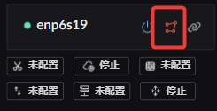
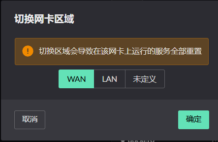
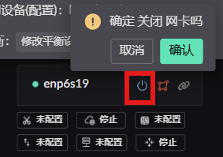
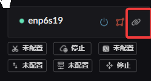
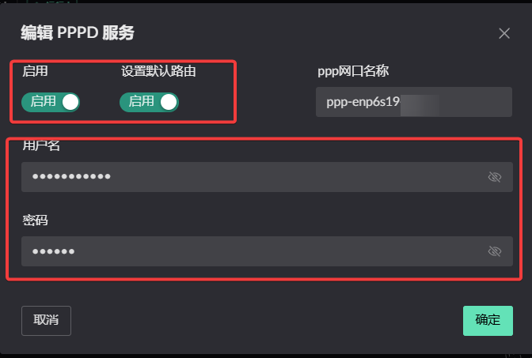
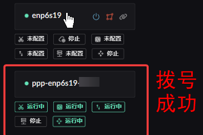
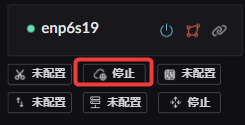
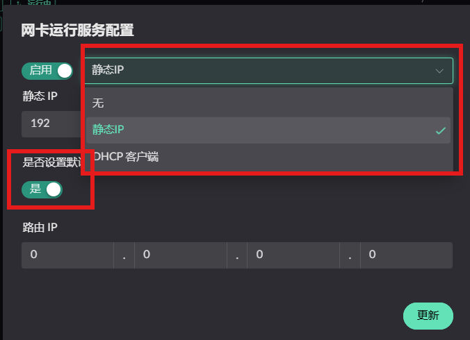
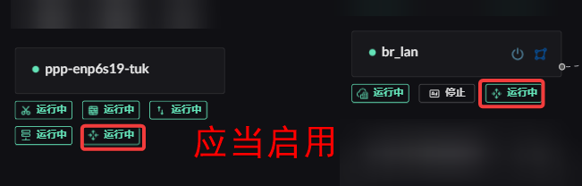

# 系统基本信息

## 创建网桥
1、创建网桥  
2、为网桥绑定网卡  
  


## 切换网卡所属区域
  
  


## 开启/关闭 网卡
 


<!-- ## 默认路由
默认路由为 flow 0 出口 -->

## 设置 PPPOE 网卡为默认路由（添加 PPPOE 账号）
1、在wan网卡上添加PPPOE账号  
2、在PPPOE账号里设为默认路由  
  
  
  
 


## 设置 Wan 网卡为默认路由
为网卡配置ip后，可开启默认路由  
  
  

## Wan 网卡配置
如无特殊要求, 可按照默认配置直接启动  
1-1 TCP MSS 钳制  
1-2 防火墙服务配置  
1-3 网卡NAT配置  
2-1 IPV6-PD 客户端配置  
2-2 Wan 路由转发服务  

  


## Lan 网卡配置
按需配置  
1-1 DHCPv4 服务配置  （包含 Mac IP 地址绑定）  
1-2 ICMPV6-RA 服务配置  
1-3 Lan 路由 转发 （应当启用）  
  


## 无线网卡 
将 hostapt 配置填入输入框中即可

## 启用 Wan 和 Lan 网卡的路由转发功
  

## vlan 配置
以 Debian 为例在 /etc/network/interfaces 中创建 vlan 网卡，设置为 manual 即可。
↓ 示例
```shell
# This file describes the network interfaces available on your system
# and how to activate them. For more information, see interfaces(5).

source /etc/network/interfaces.d/*

# The loopback network interface
auto lo
iface lo inet loopback

auto eth0
iface eth0 inet manual

# 创建 vlan id 为 10 的网卡，绑定到 物理接口 eth0
auto eth0.10
iface eth0.10 inet manual
    vlan-raw-device eth0       # 绑定物理接口

# 创建 vlan id 为 20 的网卡，绑定到 物理接口 eth0
auto eth0.20
iface eth0.20 inet manual
    vlan-raw-device eth0       # 绑定物理接口

```

